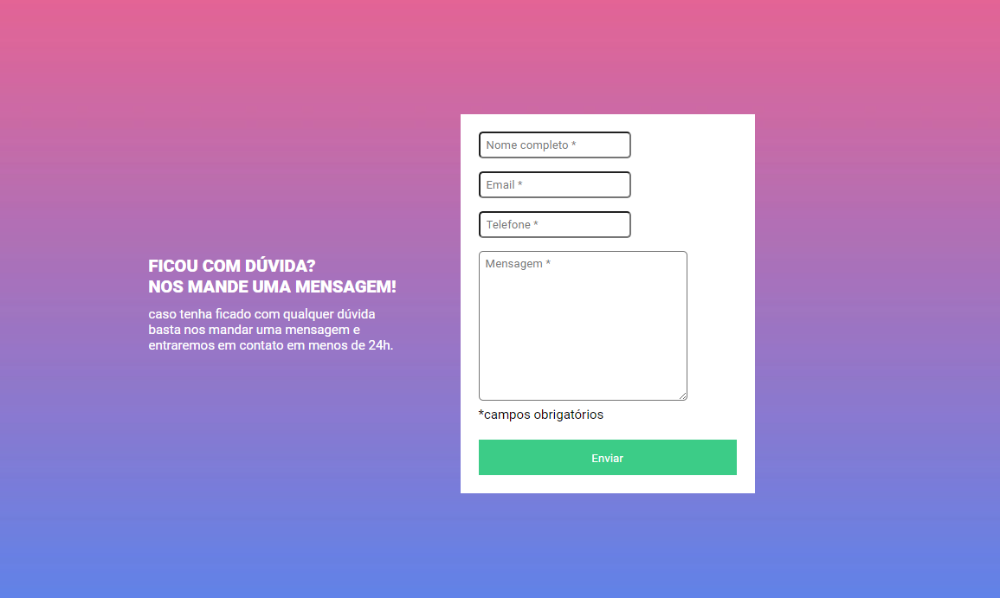
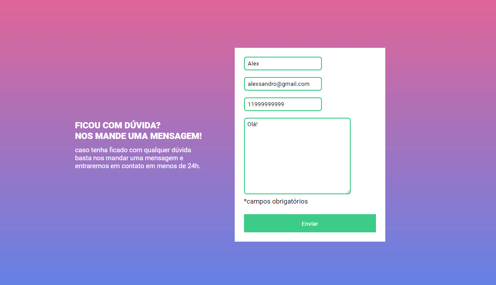
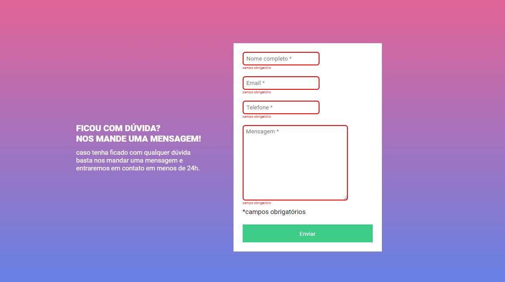

# Exercicio HTML + CSS + JS + intermediario

Um repositório para o desafio da aula de HTML + CSS + JS + intermediário.

## Índice

- [Visão geral](#visão-geral)
  - [Desafio](#desafio)
  - [Screenshot](#screenshot)
  - [Links](#links)
- [Meu processo](#meu-processo)
  - [Tecnologias utilizadas](#tecnologias-utilizadas)
- [Autor](#autor)
- [Agradecimentos](#agradecimentos)

  ## Visão geral

### Desafio

- Criar um formulário com validação
- A validação do formulário deve ser feita com javascript puro.
- Ao clicar para enviar o formulário, se caso algum campo não estiver preenchido, a borda do input deve ficar vermelha e uma mensagem de "campo obrigatório" deve aparecer embaixo do campo que não foi preenchido, conforme o figma.
- O fundo do formulário deve ser feito usando a imagem em anexo na aula.

### Screenshot

#### Desktop

### Links

- URL da página: [Desafio HTML + CSS + JS intermediário](https://alexjr53.github.io/Exercicio-HTML-CSS-JS-intermediario/) 

## Meu processo

### Tecnologias utilizadas

- HTML
- CSS
- Javascript

## Autor
Alexsandro rosa junior

- GitHub - [Alexjr53](https://github.com/Alexjr53)

## Agradecimentos
Agradecimentos a equipe [Dev em Dobro](https://www.instagram.com/devemdobro/) que está me passando o conhecimento e conceitos necessários para poder realizar esses desafios.
